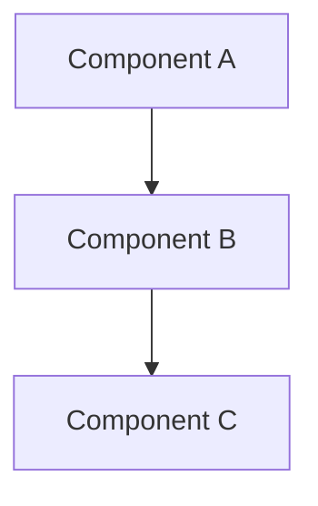

# Architecture

## Overview

[High-level architecture description]

## Components

### Component 1
- **Purpose**: [What it does]
- **Technology**: [What it's built with]
- **Interfaces**: [How it interacts with other components]

## Data Flow

[Describe data flow through the system]

## Diagrams

[Include architecture diagrams - use Mermaid or reference image files]

## Design Decisions

- [Key design decisions and rationale]

